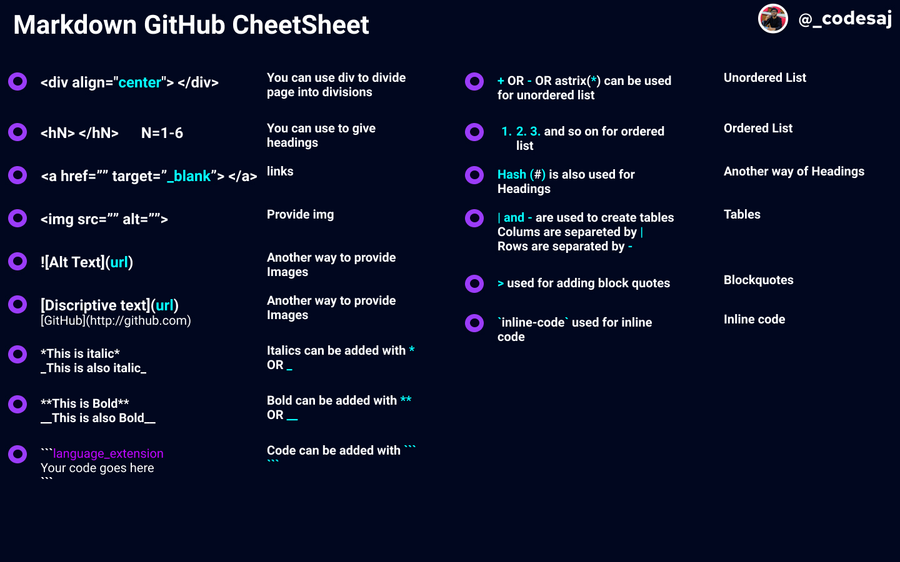

# Markdown Notes

## Headers

Headings can be added with:

```
# Heading1
## Heading2
### Heading3
#### Heading4
##### Heading5
###### Heading6
```

# Heading1

## Heading2

### Heading3

#### Heading4

##### Heading5

###### Heading6

## Emphasis

```
*This is Italic*
_This is also Italic_
```

_This is Italic_
_This is also Italic_

```
**This is Bold**
__This is also Bold__
**You can _combine_ them**
```

**This is Bold**
**This is also Bold**
**You can _combine_ them**

## Lists

**Unordered List**

```
* This is an unordered list type 1
  * This is  nested   unordered list in first type
  * Another in first type
    * More nested
    * More nested
* This is an unordered list type 1

+ This is also an unordered list
  + Nested in second type
    + More nested
    + More nested

- This is an unordered list too
  - Nested in third type
    - More nested

* This is  more consistence
  + Nested in consistence
    - More nested
    - More nested
  + Nested in consistence
* This is  more consistence
```

- This is an unordered list type 1
  - This is nested unordered list in first type
  - Another in first type
    - More nested
    - More nested
- This is an unordered list type 1

* This is also an unordered list
  - Nested in second type
    - More nested
    - More nested

- This is an unordered list too
  - Nested in third type
    - More nested

* This is more consistence
  - Nested in consistence
    - More nested
    - More nested
  - Nested in consistence
* This is more consistence

**Orderd List**

```
1. List item 1
2. List item 2
3. List item 3
```

1. List item 1
2. List item 2
3. List item 3

## Codes

- Codes can be added with <code>``` codes in between ````</code>
- We can specify code language just after <code>```js fpr javascript</code>

## Inline Code

```
`your code`
```

`your code`

## Images

```
Syntax:

```



## Links

```
Syntax:
[Discriptiove-text](url)
```

Go to [My Portfolio](https://ajay3007.github.io/)

## Tables

`|` and `-` are used to create Tables

```
Column 1 | Column 2 | Columnn3
------- | --------- | --------
R1C1 | R1C2 | R1C3
R2C1|R2C2|R2C3
...|...|...
RnC1|RnC2|RnC3

```

| Column 1 | Column 2 | Columnn3 |
| -------- | -------- | -------- |
| R1C1     | R1C2     | R1C3     |
| R2C1     | R2C2     | R2C3     |
| ...      | ...      | ...      |
| RnC1     | RnC2     | RnC3     |

## Blockquotes

```
> Blockquote
> Blockquote

> Another Blockquote
```

> Blockquote
> Blockquote

> Another Blockquote
